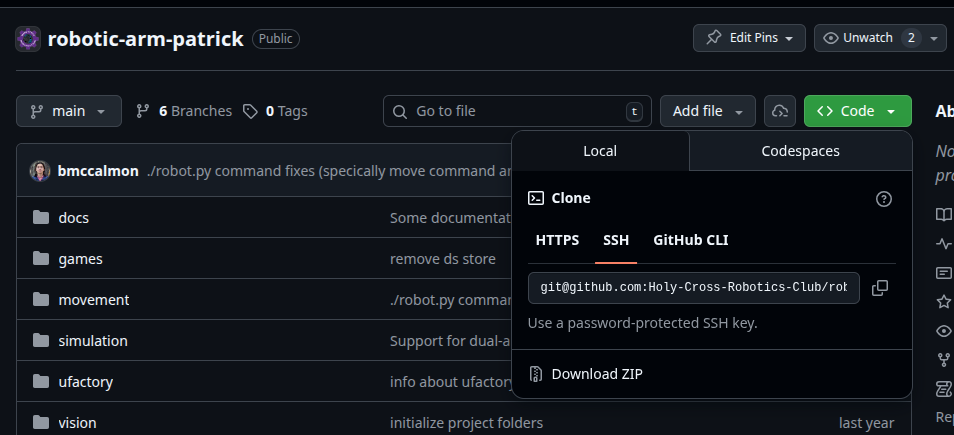

# GitHub Workshop

## Table of Contents

1. [Glossary](#glossary)
2. [Overview](#overview)
3. [Cloning a repository](#cloning-a-repository)
4. [Generating and setting up an SSH key](#generating-and-setting-up-an-ssh-key)
5. [Reading status of a repository](#reading-status-of-a-repository)
6. [Adding and committing changes](#adding-and-committing-changes)
7. [Pushing changes](#pushing-changes)
8. [Pulling changes](#pulling-changes)
9. [Branches](#branches)
10. [Quick Reference](#quick-reference)
11. [Additional Resources](#additional-resources)

## Glossary

**repository**: a version-controlled project. Can be thought of as a directory where your entire project belongs.

**version control**: save and load repository states. Think of it as a CTRL+S, and you can restore checkpoints if needed.

**git**: a version control system on your computer. Access via `git` commands.

## Overview

Git is a version control system on your computer. GitHub is an online service that allows collaboration on repositories.

We'll walk you through a few git commands to get you up and running with this project.

## Cloning a repository

We want to have our own local copy of the repository so we can work on it. `git clone` does just that. Cloning will download all project files and directories on your computer. One of these directories is a hidden `.git` that you will probably never come across (don't go try looking for it). This tracks the different states (or versions) of your project. It also tracks all the related metadata. **When you clone a repository, not only do the project files get copied locally, but also all the related versions and metadata.** This sounds intimidating, but it's exactly why we can pretty much just ignore any of this exists and let git do the work.

### Cloning our project

You want to make sure you're cloning the SSH version as the HTTPS version doesn't support SSH key access (which we will need later).



Then navigate to your Terminal or Command Prompt, and type:

```bash
git clone git@github.com:Holy-Cross-Robotics-Club/robotic-arm-patrick.git
```

This will create a `robotic-arm-patrick` directory in your current location with all the project files.

### TLDR

```bash
git clone git@github.com:<org-name>/<repo-name>.git
```

## Generating and setting up an SSH key

SSH keys allow you to authenticate with GitHub without typing your username and password every time. Think of it like a secure handshake between your computer and GitHub.

### Check if you already have an SSH key

```bash
ls -la ~/.ssh
```

Look for files named `id_rsa.pub`, `id_ed25519.pub`, or similar. If you see these, you already have a key and can skip generation.

### Generate a new SSH key

**On Linux/Mac:**
```bash
ssh-keygen -t ed25519 -C "your_email@example.com"
```

**On Windows (Git Bash):**
```bash
ssh-keygen -t ed25519 -C "your_email@example.com"
```

Press Enter to accept the default file location. You can optionally set a passphrase for extra security (or just press Enter for no passphrase).

### Add your SSH key to GitHub

1. Copy your public key to clipboard:
   
   **Linux:**
   ```bash
   cat ~/.ssh/id_ed25519.pub
   ```
   Then select and copy the output.
   
   **Mac:**
   ```bash
   pbcopy < ~/.ssh/id_ed25519.pub
   ```
   
   **Windows (Git Bash):**
   ```bash
   clip < ~/.ssh/id_ed25519.pub
   ```

2. Go to GitHub → Settings → SSH and GPG keys → New SSH key
3. Paste your key and give it a descriptive title (e.g., "My Laptop")
4. Click "Add SSH key"

### Test your connection

```bash
ssh -T git@github.com
```

You should see: `Hi username! You've successfully authenticated...`

### TLDR

```bash
# Generate key
ssh-keygen -t ed25519 -C "your_email@example.com"

# Copy public key and add to GitHub settings
cat ~/.ssh/id_ed25519.pub

# Test connection
ssh -T git@github.com
```

## Reading status of a repository

`git status` shows you what's changed in your working directory.

### What it shows:
- **Untracked files**: New files Git isn't tracking yet
- **Modified files**: Existing files you've changed
- **Staged files**: Files ready to be committed
- **Current branch**: Which branch you're working on

### Example

```bash
git status
```

**Output might look like:**
```
On branch main
Your branch is up to date with 'origin/main'.

Changes not staged for commit:
  modified:   movement/robot.py

Untracked files:
  movement/new_script.py

no changes added to commit
```

### TLDR

```bash
git status              # Check what's changed
```

## Adding and committing changes

After you've made changes to files, you need to **stage** them (using `git add`) and then **commit** them (using `git commit`). Think of staging as preparing items for a photo, and committing as taking the actual snapshot.

### Stage files

```bash
# Stage a specific file
git add movement/robot.py

# Stage all changed files
git add .

# Stage all Python files
git add *.py

# Stage everything in a directory
git add movement/
```

### Commit staged changes

```bash
git commit -m "Your commit message here"
```

### Commit message best practices

**Good commit messages:**
- `"Fix servo communication bug in controller.py"`
- `"Add diagnostic scripts for USB troubleshooting"`
- `"Update robot.py argument parsing logic"`

**Bad commit messages:**
- `"fixed stuff"`
- `"asdf"`
- `"updates"`

### TLDR

```bash
git add .                                    # Stage all changes
git commit -m "Descriptive message here"     # Commit with message
```

## Pushing changes

Push uploads your local commits to GitHub so others can see them.

### Basic push

```bash
git push
```

If tracking is not already set up yet, then git will give you a recommended command to use. It's probably okay to use that.

### What if push fails?

If someone else pushed changes since you last pulled, you'll need to pull first:

```bash
git pull
# Resolve any conflicts if they occur
git push
```

### TLDR

```bash
git push
```

## Pulling changes

Pull downloads changes from GitHub and merges them into your local branch. **Always pull before starting work** to avoid conflicts.

### Basic pull

```bash
git pull
```

This does two things:
1. **Fetches** changes from GitHub
2. **Merges** them into your current branch

### Resolving merge conflicts

1. Open the conflicting file(s). You'll see markers like:
   ```python
   <<<<<<< HEAD
   # Your local changes
   print("Hello from local")
   =======
   # Changes from GitHub
   print("Hello from remote")
   >>>>>>> abc123def456
   ```

2. Edit the file to keep what you want (remove the markers)
3. Stage the resolved file:
   ```bash
   git add movement/robot.py
   ```

4. Commit the merge:
   ```bash
   git commit -m "Resolved merge conflict in robot.py"
   ```

### TLDR

```bash
git pull                # If tracking is already set up
```

## Branches

Branches let you work on features or fixes without affecting the main codebase. Think of them as parallel universes where you can experiment safely.

### Why use branches?

- Work on features without breaking main code
- Test experimental ideas
- Collaborate without stepping on each other's toes
- Keep a clean history of what changed when

### Create a new branch

```bash
# Create branch
git branch feature-name

# Create and switch to branch in one command
git checkout -b feature-name
```

### Switch branches

```bash
git checkout branch-name
```

### List branches

```bash
# List local branches
git branch

# List all branches (including remote)
git branch -a
```

### Merge a branch

When your feature is done, just commit and push the changes (within the appropriate branch). One of our project leaders will merge them for you.

### Branches best practices

1. **Always create a branch for new features or fixes**
   ```bash
   git checkout -b fix-servo-bug
   ```

2. **Use descriptive branch names**
   - Good: `feature-add-diagnostics`, `fix-usb-timeout`, `docs-update-readme`
   - Bad: `test`, `temp`, `my-branch`

3. **Keep branches short-lived**
   - Merge frequently to avoid large conflicts
   - Delete branches after merging

4. **Pull main regularly while working on a branch**
   ```bash
   git checkout feature-branch
   git pull origin main
   ```
   This keeps your branch up-to-date and reduces conflicts later.

### Typical branch workflow

```bash
# 1. Start from main
git checkout main
git pull

# 2. Create feature branch
git checkout -b add-new-feature

# 3. Make changes and commit
git add .
git commit -m "Add new feature"

# 4. Push branch to GitHub
git push
```

### TLDR

```bash
git checkout -b branch-name    # Create and switch to new branch
git checkout branch-name       # Switch to existing branch
git branch                     # List branches
git merge branch-name          # Merge branch into current branch
git branch -d branch-name      # Delete branch locally
```

## Quick Reference

| Command | Description |
|---------|-------------|
| `git clone <url>` | Copy a repository to your computer |
| `git status` | Check what files have changed |
| `git add .` | Stage all changes |
| `git commit -m "message"` | Save changes with a description |
| `git push origin main` | Upload commits to GitHub |
| `git pull origin main` | Download changes from GitHub |
| `git checkout -b branch` | Create and switch to new branch |
| `git merge branch` | Merge branch into current branch |
| `git log` | View commit history |

## Additional Resources

- [Official Git Documentation](https://git-scm.com/doc)
- [GitHub Guides](https://guides.github.com/)
- [Interactive Git Tutorial](https://learngitbranching.js.org/)
- [Git Cheat Sheet](https://education.github.com/git-cheat-sheet-education.pdf)